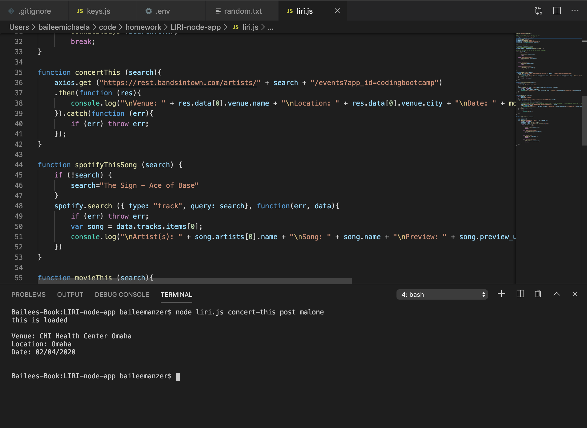
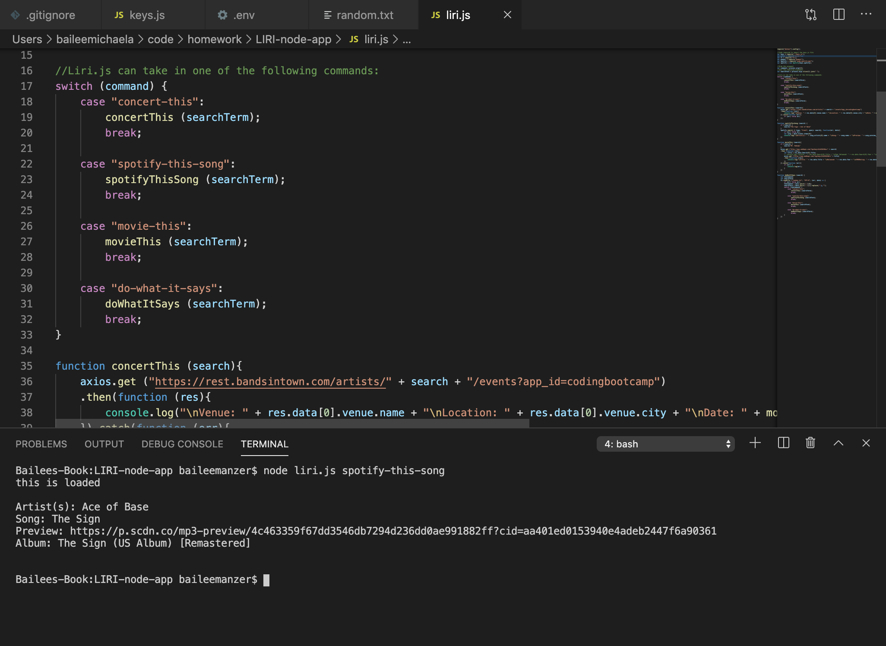
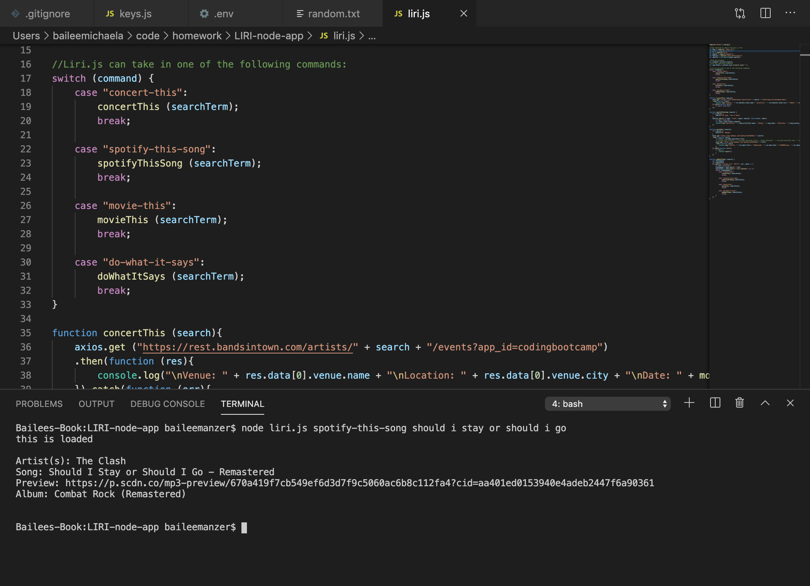
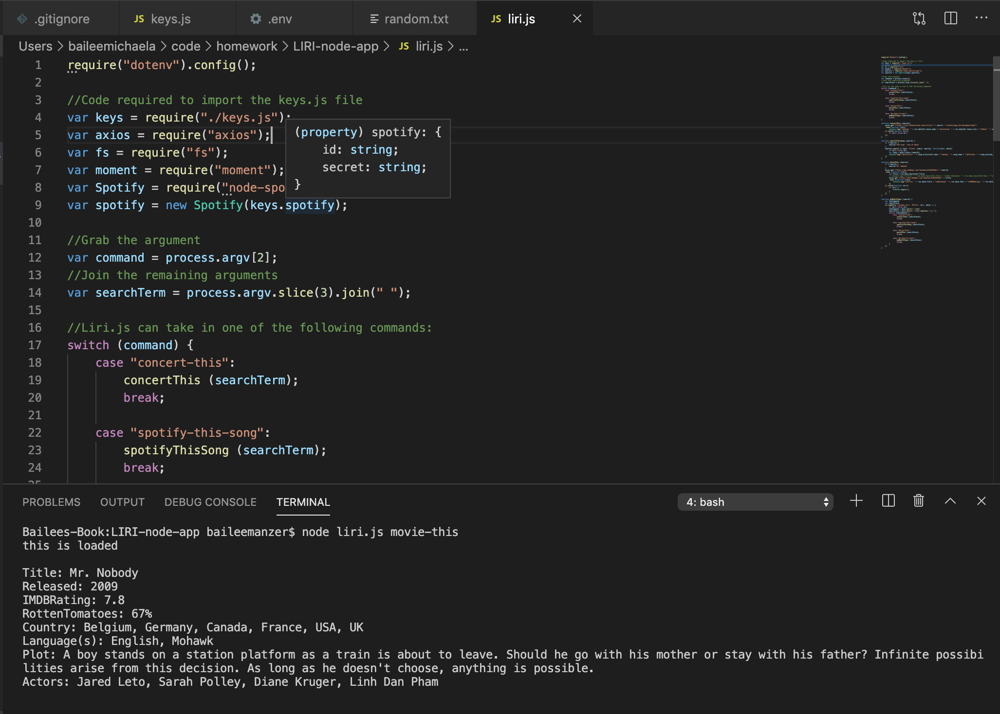
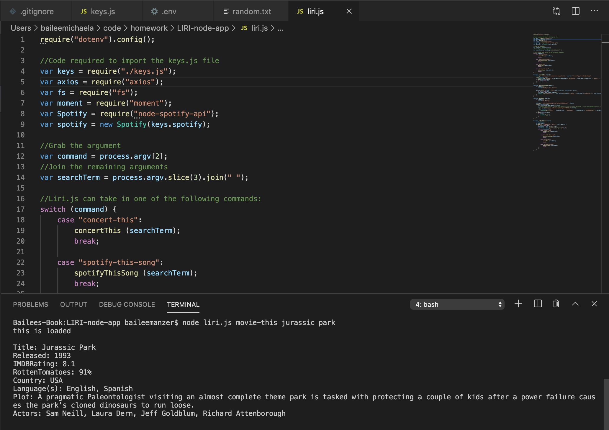
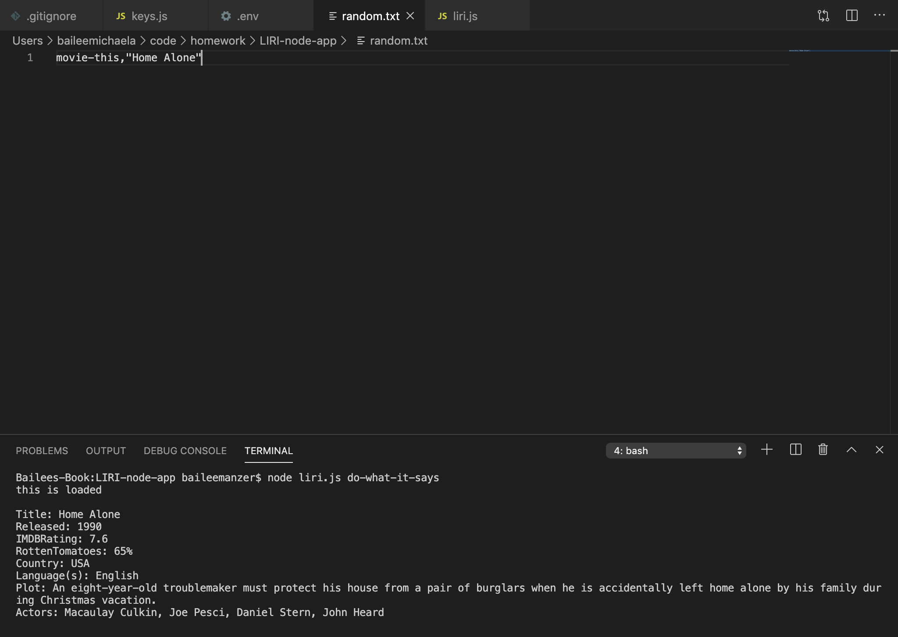

# LIRI-node-app
LIRI-bot
Created LIRI, a Language Interpretation and Recognition Interface. LIRI will be a command line node app that takes in parameters and gives you back data.

## App Use & Purpose
The app will search the Bands in Town Artist Events API for an artist and show the name of the venue, venue location, and date of the event in the terminal. The app will also show the artist, songs name, a preview link of the song from Spotify, and the album of the song. If no song is provided, the program will default to "The Sign" by Ace of Base. The movieThis command will show the title, release year, IMDB rating, rotten tomatoes rating, production country, language, plot, and actors of the movie into the terminal. If no movie is provided, "Mr. Nobody" information will appear. 

## How to Guide
There are four different commands you can run: (1)concert-this, (2)spotify-this-song, (3)movie-this, (4)do-what-it-says. You must enter "node liri.js" + the command you want to run. Depending on which command is run, a concert will show up, a song, a movie, or the do-what-it-says command. 

## GIFS/VIDEOS/SCREENSHOTS
Deployed App
Here is the link to the deployed applications-->  https://baileemmanzer.github.io/LIRI-node-app/

concert-this command:

spotify-this-song command:

movie-this command:

do-what-it-says command:

## Technologies Used
1. Axios
2. Node-Spotify-API
3. OMDB API
4. Bands in Town API
5. Moment
6. DotEnv
7. HTML
8. CSS
